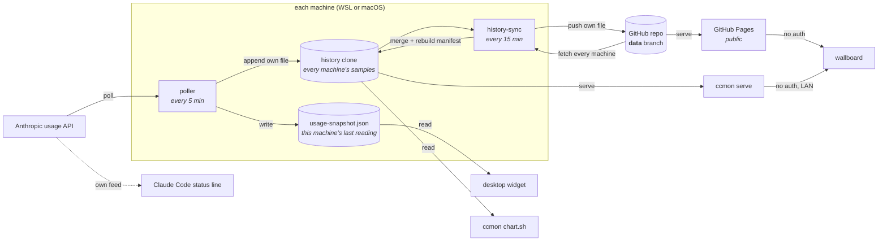

# aicon-ccmon

Tells you whether to speed up or slow down so you finish each quota window at
95% — using as much as you have paid for, without running out.

The Anthropic API reports only what your usage is *right now*, with no history
endpoint, and no absolute token figures at all (`limit_dollars` and friends are
null on a Team plan). ccmon polls it every 5 minutes, keeps a local snapshot,
and commits each sample so the trend survives.

For each window it answers three things:

| | |
|---|---|
| **when does it renew** | "resets in 3h 43m" |
| **speed up or slow down** | "faster 1.5x", "on pace", "ease off 0.7x" |
| **by how much** | "16%/day still available" |

The bar carries the absolute level, with a tick marking where usage *would* be
if the window were spent evenly to 95% — the gap between that tick and the end
of the fill is your headroom.

## How the parts fit together



Four moving parts, each with one job:

| Part | Reads | Writes |
|---|---|---|
| **poller** | the usage API | the snapshot, and one line in *its own* history file |
| **widget** | the snapshot only — this machine's own last reading | a small panel on the desktop |
| **repo** | — | the `data` branch, compacted as it grows |
| **wallboard** | every machine's samples, merged | a screen you can read across a room |

**Sync is two-way.** Each run fetches the `data` branch and hard-resets onto it,
keeping only this machine's own two files, then rebuilds the manifest from every
machine's latest reading. So the local clone ends up holding *everyone's*
samples — which is what `chart.sh`, `ccmon serve` and the wallboard read. One
file per machine is what makes that safe: no two machines ever write the same
file, so the pushes cannot conflict.

**The widget is the exception.** It reads only `usage-snapshot.json`, never the
merged history. That is usually invisible, because the quota is account-wide and
every machine reports the same numbers — but if *this* machine's poller is backed
off or its token has expired, the widget shows stale while another machine may
have pushed fresher figures minutes ago.

The status line is fed by Claude Code itself rather than by ccmon, so it keeps
working even when the poller is backed off or offline.

## Use it

```sh
git clone https://github.com/baloise/aicon-ccmon
cd aicon-ccmon
./ccmon
```

That is the whole setup. `./ccmon` checks what is present, explains anything
that is missing at the point where it matters, and offers to fix it. It is safe
to re-run at any time, and re-running after a successful pass changes nothing.

```
./ccmon status      read-only summary
./ccmon serve       serve the wallboard locally, no GitHub sign-in needed
./ccmon update      git pull, then re-apply whatever drifted
./ccmon uninstall   remove the timers and installed files
```

Deliberately, setup instructions live **only** in `./ccmon` — not here, not in an
example env file, not in comments in the scripts. One account of the procedure,
attached to the code that performs it.

For the reverse-engineered API details and the reasoning behind the design, see
[`docs/findings.md`](docs/findings.md).

## The desktop widget

Sits *on* the desktop rather than above your work: bottom of the Z-order, no
taskbar entry, no alt-tab, and it never takes focus. Home is the top-right
corner: drag it anywhere you like and it stays there, but a resolution change,
a monitor arriving or leaving, or a dock sends it home - the arrangement you
placed it in no longer exists, and a corner is somewhere you can always find
it again.

The status dot - in the notification area on Windows, the menu bar on macOS -
is how you reach it. Its colour is the pace verdict of whichever window is
pacing worse, not how full either one is, so it stays green while you are within
budget however much of the quota is already spent:

| | |
|---|---|
| left-click | toggles between the desktop and the front, and stays there |
| right-click | move widget · bring to front / send to desktop · hide / show · open wallboard · refresh now · update · quit |

The first two menu entries are toggles that relabel themselves, so the menu
always states what the click will do rather than what the state currently is.

"Refresh now" runs the poller rather than waiting for the next tick - inside
WSL on Windows, directly on macOS.

Either way it is a small compiled executable, built on the fly by `./ccmon`
with a compiler the operating system already has, so there is nothing to
install and the repository ships source rather than a binary.

**On Windows** that compiler is the `csc.exe` from the .NET Framework, and
being compiled is not gratuitous: Windows identifies a tray icon by (executable
path + uID), so anything hosted by `powershell.exe` shares an identity with
every other PowerShell tray icon and can never get its own row under Settings >
Taskbar > Other system tray icons. ccmon pins it there rather than leaving it in
the hidden overflow.

**On macOS** it is `swiftc` from the Command Line Tools, and the widget sits
above the wallpaper and *under* the desktop icons. That last part costs the
drag: Finder's desktop window covers the whole screen and is above us, so it
takes every click that passes over the panel, and the widget never sees one.
"Move widget" in the menu lifts it just long enough to be dragged and drops it
back the moment you let go. `--level icons` trades that back the other way -
directly draggable, at the price of painting over the desktop icons.

Its colours come from the wallpaper underneath it. The widget samples the pixels
behind the panel and asks how little scrim it can wear and still be read: a light
wallpaper gets the light palette, a dark one the dark palette, and the opacity is
whatever the contrast actually requires - measured on one ordinary photo, 26%
rather than the fixed 90% Windows uses. "Readability" in the menu sets the target
the text must hit, not the opacity, so there is no setting at which it becomes
unreadable; Appearance pins the palette if the measurement disagrees with taste,
and can turn the whole thing off.

Two other things are worse here than on Windows, and neither has a fix an
installer can apply: a menu bar item cannot be pinned, so on a notched Mac with
a crowded menu bar it can end up under the notch; and there is no balloon tip,
so "Update ccmon" opens a Terminal window and lets it speak for itself.

## The wallboard

Two ways to reach the same page:

- **GitHub Pages** — published from the `data` branch at
  <https://baloise.github.io/aicon-ccmon/>. No sign-in, nothing to install.
- **`./ccmon serve`** — the same page over plain HTTP from your own machine, no
  authentication at all. This is what an unattended screen should point at, since
  a kiosk browser will eventually be asked to sign in again.

Add `?theme=dark` to pin the theme; a browser with no preference resolves to
light, which is rarely what you want on a wall.

The page polls the published data and redraws itself every minute. It will not
work opened as a `file://` URL — `fetch` is blocked there, which is exactly why
the local option is a server rather than just opening the file.

## What it will not do

ccmon reads Claude Code's OAuth token - from `~/.claude/.credentials.json` on
Linux and WSL, and from the login Keychain on macOS, where Claude Code keeps the
same JSON as the secret of a generic password. It never refreshes or rotates that
token — doing so could log Claude Code out from under you. When the token
expires the snapshot is marked stale and keeps the last known values until you
use Claude Code again.

Nothing identifying reaches the repo: samples are timestamps and percentages.

## Licence

Apache-2.0. See [LICENSE](LICENSE).

The published data is a record of one account's Claude usage over time, including
the hours during which it was used. Machines are identified by a random id rather
than their hostname, which keeps naming conventions private — but commit
authorship still identifies who runs it, so this is not anonymous data.
